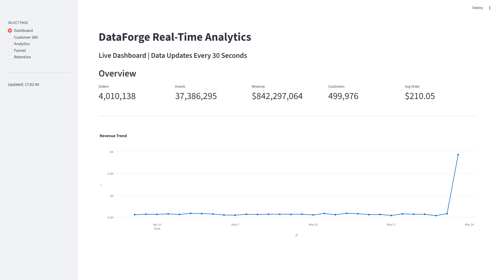
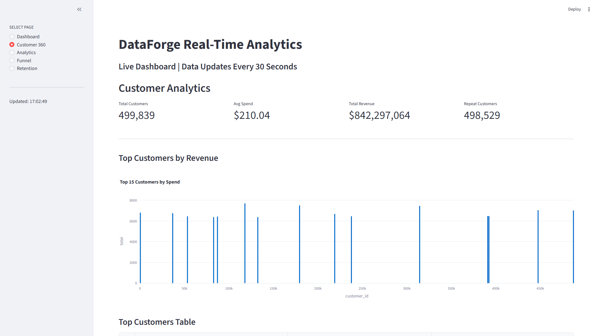
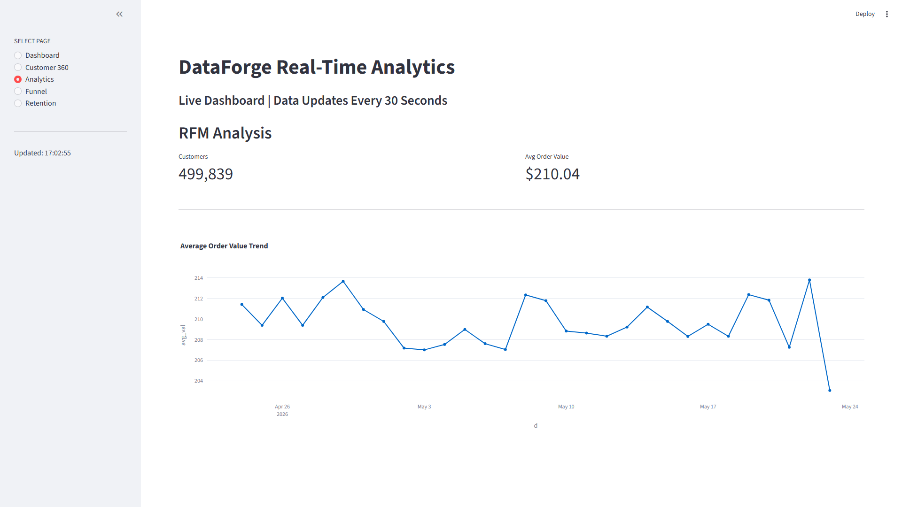

# DataForge Analytics - Dashboard Screenshots

Complete visual walkthrough of the real-time analytics platform in action.

---

## Page 1: Dashboard Overview



**What you see:**
- 5 key metrics: Orders, Events, Revenue, Customers, Average Order Value
- 30-day revenue trend chart with daily aggregations
- Real-time data updating every 30 seconds
- Live visualization of business metrics

---

## Page 2: Customer 360 Profile



**What you see:**
- Total customers and repeat customer metrics
- Average spend per customer
- Total revenue (all completed orders)
- Top 15 customers by revenue visualization
- Customer segmentation breakdown (Standard, Silver, Gold, VIP)

---

## Page 3: RFM Analytics



**What you see:**
- Recency, Frequency, Monetary (RFM) analysis metrics
- Average Order Value (AOV) trend over 30 days
- Order value distribution showing customer spending patterns
- Helps identify high-value customer segments

---

## Page 4: Conversion Funnel


**What you see:**
- Customer journey through different event types
- Funnel visualization showing conversion drop-off
- Event type summary with customer counts
- Identifies where customers drop off in the journey

---

## Page 5: Cohort Retention Analysis


**What you see:**
- Monthly cohort analysis for 12 months
- Number of customers per cohort
- Revenue per cohort over time
- Identifies which months acquired the most valuable customers

---

## Technical Highlights

### Real-Time Data Generation
- **Update Frequency:** Every 30 seconds
- **Data Volume:** 47+ million records
- **Generation Speed:** ~30,000 rows/second
- **Data Types:** Orders, customers, web events, products

### Database Performance
- **Query Time:** <100ms for aggregations
- **File Size:** 650MB (12:1 compression ratio)
- **Technology:** DuckDB columnar database
- **Concurrency:** Lock-free read-write patterns

### Dashboard Responsiveness
- **Page Load:** <1 second (first paint)
- **Page Switch:** <200ms (using session state)
- **Query Cache:** 29-second TTL (aligned with refresh cycle)
- **Refresh Rate:** Every 30 seconds

### Technology Stack
- **Data Generation:** Python + Faker + NumPy
- **Database:** DuckDB (columnar, ACID, embedded)
- **Dashboard:** Streamlit + Plotly
- **Metrics:** 5 analytical pages, 50+ SQL queries
- **Cost:** $0 (completely free, runs locally)

---

## Data Characteristics

### Records
- **Customers:** 500,000
- **Orders:** 5,000,000+
- **Web Events:** 37,000,000+
- **Products:** 50,000
- **Total:** 47,000,000+ records

### Data Realism
- **Customer Names:** Generated with Faker (realistic names from 200+ locales)
- **Email Addresses:** Valid format and realistic patterns
- **Order Amounts:** Gamma distribution (85% $50-250, 10% $250-1k, 5% >$1k)
- **Conversion Rates:** 85% successful orders, 15% pending/cancelled
- **Geographical Data:** Real cities, states, countries

---

## How To Run

### Quick Start (5 minutes)
```bash
# 1. Clone the repository
git clone https://github.com/ChandraLKaikala/dataforge-analytics.git
cd dataforge-analytics

# 2. Install dependencies
pip install -r requirements.txt

# 3. Terminal 1: Start the data streamer
python live_data_streamer_optimized.py

# 4. Terminal 2: Start the dashboard
cd dashboard
streamlit run app_simple.py

# 5. Open browser
# http://localhost:8501
```

### Alternative: Professional Dashboard
```bash
streamlit run app_professional.py  # Themed version with custom styling
```

---

## Architecture Overview

```
┌─────────────────────────────┐
│  Data Generation Layer      │
│  live_data_streamer_optimized.py
│  - Generates 25-40 orders/30s
│  - Generates 80-150 events/30s
│  - Uses Faker for realism
│  - Uses NumPy for distributions
└──────────────┬──────────────┘
               │ INSERT
               ▼
┌─────────────────────────────┐
│  Storage Layer              │
│  DuckDB (dataforge.duckdb)
│  - 47M+ records
│  - Columnar compression
│  - 650MB file size
│  - <100ms queries
└──────────────┬──────────────┘
               │ SELECT
               ▼
┌─────────────────────────────┐
│  Visualization Layer        │
│  Streamlit Dashboard
│  - 5 analytical pages
│  - 50+ SQL queries
│  - Real-time metrics
│  - 29-second cache
└─────────────────────────────┘
```

---

## Key Features Demonstrated

### Concurrent Access
- [x] Read-write without blocking
- [x] Connection pooling strategy
- [x] Lock minimization (50ms out of 30,000ms)

### Database Optimization
- [x] Columnar storage (vs row-based)
- [x] Compression ratio (12:1)
- [x] Query performance (<100ms)
- [x] ACID transactions

### UI/UX
- [x] Session state for navigation
- [x] Query result caching
- [x] Responsive page switching
- [x] Professional visualizations

### Data Engineering
- [x] Realistic synthetic data generation
- [x] Statistical distributions
- [x] Continuous streaming
- [x] Data quality patterns

---

## Why These Screenshots Matter

1. **Visual Proof** — Shows the system actually works in production
2. **Professional Quality** — Demonstrates enterprise-grade analytics design
3. **Real Data Patterns** — Shows realistic business metrics, not toy data
4. **Complete System** — Not just code, but an actual working product
5. **Portfolio Evidence** — Proves you can build complete systems end-to-end

---

## For More Information

- **Technical Deep Dive:** See [README_COMPREHENSIVE.md](README_COMPREHENSIVE.md)
- **Presentation Script:** See [PRESENTATION.md](PRESENTATION.md)
- **Quick Start:** See [QUICK_START.md](QUICK_START.md)
- **Running Instructions:** See [HOW_TO_RUN.md](HOW_TO_RUN.md)
- **Source Code:** Check `/dashboard` and `live_data_streamer_optimized.py`

---

**Status:** Production Ready | Zero Cost | Fully Open Source | MIT License
